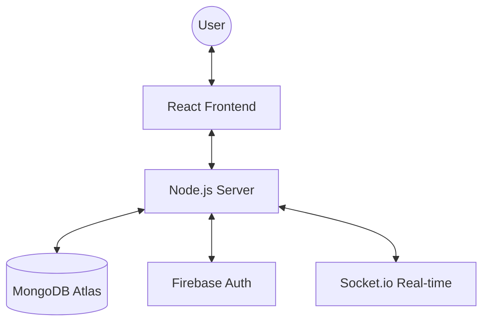

# 🏗️ System Architecture

CrowdVote AI is built as a **Modern Full-Stack Web Application**. It uses a client-server model where the frontend (User Interface) communicates with the backend (Server Logic) via standardized APIs.

## 🧱 The Three Pillars
1.  **Frontend (The Face)**: Built with **React 19**. This is what you see in the browser. It is fast, responsive, and uses **Tailwind CSS 4** for its premium look.
2.  **Backend (The Brain)**: Built with **Node.js** and **Express**. This manages user accounts, calculates election stats, and handles secure data.
3.  **Database (The Memory)**: Uses **MongoDB**. This stores all 140 constituencies, thousands of candidates, and every single user prediction.

## 🔄 Data Flow

## 🔒 Security Layer
- All user data is protected by **JWT (JSON Web Tokens)**.
- Sensitive actions like voting require an active session.
- Authentication is handled by **Firebase**, providing Google Login and Phone OTP verification.
